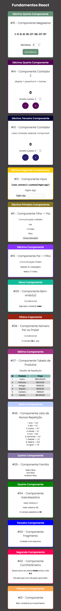

# Fundamentos-React

Esse repositório contém meus estudos e prática, da parte **FUNDAMENTOS REACT**, do [curso da Udemy](https://www.udemy.com/course/react-redux-pt/) do Leonardo Moura Leitão.

## Caderno de Anotações
[ANOTAÇÕES.md](https://github.com/barbaracalderon/fundamentos-react/blob/master/ANOTACOES.md)

**DESKTOP**

 

**MOBILE**

 

